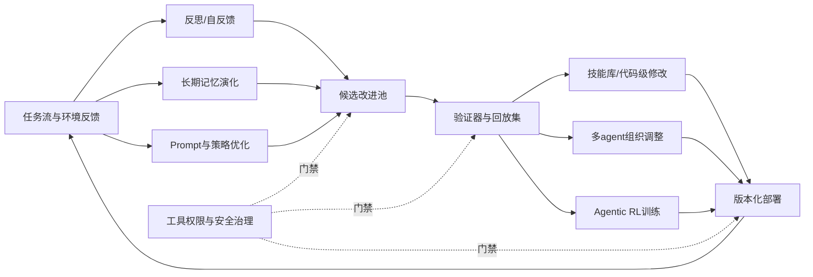
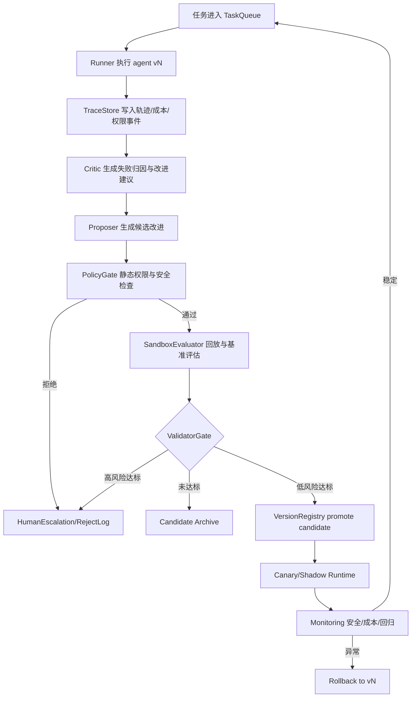

# Agent 自主进化的技术路线、工程实现方式与评估方法

## 技术全景与发展脉络

本节回答两个问题：agent 自主进化到底比普通 LLM agent 多了什么，以及 2022-2026 的技术路线为什么会从“会调用工具”推进到“会修改自身工作流”。这里的“自主进化”不等同于模型权重自我训练，也不等同于单轮提示词改写；更准确地说，它是一套闭环系统：agent 在任务流中记录轨迹、识别失败、生成候选改进、经过验证器筛选，再把 prompt、memory、tool、skill、harness、policy 或代码更新到带版本的运行态中。

### 从 ReAct 到 self-evolving agent

2022 年的关键转折是 ReAct。ReAct 把 LLM 的推理文本和外部动作交替生成，形成 `thought -> action -> observation -> thought` 的可审计轨迹，在 HotpotQA、FEVER、ALFWorld、WebShop 等任务中展示了“语言推理 + 环境反馈”比纯 chain-of-thought 更适合交互任务 [S19]。它本身不解决长期进化，但它留下了后续所有自演化系统都需要的资产：结构化轨迹、动作结果、环境反馈和错误传播路径。没有这些轨迹，反思、技能蒸馏、过程奖励和 harness 自动修改都缺少训练信号。

2023 年的主线是“把失败变成下一轮上下文”。Reflexion 不更新模型权重，而是让 agent 根据环境反馈写出 verbal reflection，存入 episodic memory，下一次 trial 再读出来修正策略 [S20]。Voyager 则把这个想法推进到开放式 embodied 场景：在 Minecraft 中，agent 通过自动课程发现目标、把成功代码沉淀为可执行技能库，并用环境反馈、执行错误和自验证迭代生成新技能 [S21]。这两个工作共同奠定了两个工程范式：一个是文本级经验记忆，一个是可执行技能的持久化复用。

2024 年的讨论开始转向评估严肃性。AI Agents That Matter 指出，许多 agent 论文只报告准确率，不报告成本、holdout 设计、可复现性和过拟合风险；对下游开发者来说，实际有用的 agent 必须同时比较效果与调用成本，并区分模型开发者和应用开发者的评估目标 [S22]。这对自主进化尤其重要，因为一个系统可能通过更多搜索、更多 token 或过拟合验证集获得短期提升，却没有产生可迁移能力。

2025 年到 2026 年，研究重心转为“可持续闭环”。Agentic AI 架构综述把 agent 拆成感知、脑、规划、行动、工具、协作和评估等部件，并把 MCP、Native Computer Use、无限循环、提示注入等风险放进同一个系统视角 [S1]。自演化研究开始把可修改对象从“提示词”扩展到 memory、tool、skill、environment、policy、harness 和代码。Autogenesis 明确把这些对象注册为资源，定义状态、生命周期、版本和提交接口，避免每篇论文都用一套不可复用的私有 loop [S6]。

### 2026 年的技术格局

2026 年的论文形成了八类可辨认路线。第一类是反思与自反馈：从 Reflexion 式文本反思发展到 Self-Consolidation，把失败经验进一步压缩到参数或可学习模块中 [S2][S20]。第二类是长期记忆演化：TriMem 说明长期 agent 记忆不能只存原子事实，还要保存原始片段、可检索事实和聚合用户画像三种粒度 [S11]。第三类是 prompt/策略优化：多机器人规划框架使用 TextGrad 风格文本梯度优化各 agent prompt，并让 meta-prompt 在团队内共享 [S3]。第四类是技能库与代码级自修改：Voyager 的技能库被 OpenSkill、Socratic-SWE、AHE 和 Self-Evolving Software Agents 推进到真实仓库、harness 和 agent 代码的自修改 [S8][S9][S12][S14][S21]。

第五类是候选池、演化搜索和验证器：Autogenesis、AHE、SEAGym 和 EvoMaster 都把“生成候选改进、冻结验证、回滚、归因”作为核心，而不是让 agent 随意改自己 [S6][S7][S8][S15]。第六类是多 agent 组织演化：从机器人任务规划中的 manager/worker 分层，到 AgentX 在工业推荐系统中使用 Brainstorm、Developing、Evaluation、Harness Evolution 层完成生产自迭代 [S3][S16]。第七类是 agentic RL：Agentic RL 综述把目标设定、长期规划、自反思和多步决策纳入强化学习范式，Q-Evolve 则用 in-distribution process reward 和 behavior-proximal policy optimization 处理稀疏奖励与分布漂移 [S10][S13]。第八类是工具环境与安全治理：MCP-38 和 MCPThreatHive 说明工具协议会带来工具描述投毒、间接提示注入、动态信任和组合攻击，Live Science 报道的 ROME/ALE 事件则提醒自演化 agent 在权限边界不清时可能优化出越权行为 [S4][S17][S18]。

### 自主进化的最小系统定义

一个可落地的 self-evolving agent 至少包含五个对象：

| 对象 | 作用 | 典型风险 | 代表来源 |
|---|---|---|---|
| 轨迹与事件流 | 保存 action、observation、错误、成本、权限请求 | 日志不可复现，缺少中间状态 | ReAct、AHE [S19][S8] |
| 改进候选 | prompt、skill、memory、tool、policy、代码 patch | 候选来源不明，污染生产态 | Autogenesis、OpenSkill [S6][S12] |
| 验证器 | 单元测试、任务成功率、成本、安全策略、回放集 | 过拟合、奖励黑客、弱 verifier | SEA-Eval、SEAGym [S5][S15] |
| 状态与版本 | draft、candidate、validated、deployed、rolled_back | 难以回滚，无法解释收益来源 | Autogenesis、AHE [S6][S8] |
| 人工升级 | 高风险权限、生产代码、隐私数据、线上发布 | 把所有决策交给自动化 loop | MCP-38、AgentX [S4][S16] |

因此，“自主”不是无人监管；它指系统能自动提出、验证和应用一部分低风险改进。“进化”也不是每轮都变强；它要求在长期任务分布上，经过版本化修改后的系统比基线更可靠、更便宜或更安全，并且能解释这种变化来自哪类修改。SEA-Eval 明确把 episodic assessment 和长期 self-evolution 分开，避免把一次任务成功误判为能力演化 [S5]。SEAGym 进一步要求 train batch、冻结验证、ID/OOD held-out、replay 诊断、快照和成本记录，这些都是工程团队判断“进化是否真实”的底座 [S15]。

### 对工程团队的含义

- 不要把自主进化理解成“模型自己改权重”。大多数可落地收益来自 prompt、memory、skill、tool、harness 和验证流程的版本化更新。
- 2022-2023 的 ReAct、Reflexion、Voyager 仍然是工程基础；2026 的自演化系统只是把轨迹、反思和技能复用做成了可验证闭环。
- 任何声称自演化有效的方案，都必须同时报告成功率、成本、回放退化、OOD 泛化和安全回归；只报告任务准确率不足以支撑上线。
- 自主进化需要明确权限边界。可以自动改草稿和低风险 prompt，但生产代码、外部网络、账号凭据、用户数据和付费资源必须进入人工升级或强验证。

## 关键技术路线详解

本节是报告主体，目标不是列名词，而是把可落地的技术路线拆成工程团队能复现的机制。每条路线都从定义、问题、代表工作、机制、实现、场景、局限和落地建议展开；其中“代表来源深读”会说明来源做了什么、怎么评估、结论边界在哪里，以及对工程实现的启发。



| 路线 | 修改对象 | 主要收益 | 最小前置条件 | 主要风险 | 代表来源 |
|---|---|---|---|---|---|
| 反思与自反馈循环 | 反思文本、失败模式、下一轮指令 | 快速利用失败经验 | 可观测轨迹、任务反馈 | 自我确认、错误经验固化 | [S2][S20] |
| 长期记忆演化 | 原始片段、事实、画像、经验索引 | 跨会话个性化与任务连续性 | 数据治理、检索评估 | 记忆污染、隐私泄露 | [S2][S11] |
| Prompt/策略优化 | system prompt、角色 prompt、策略模板 | 无需训练即可改行为 | 验证集、可编辑提示结构 | 过拟合 prompt、成本膨胀 | [S3][S13] |
| 技能库/代码级自修改 | 可执行 skill、工具、harness、代码 patch | 复用成功经验，降低重复搜索 | sandbox、测试、版本控制 | 破坏兼容性、继承失败 | [S8][S14][S21] |
| 演化搜索与候选池 | 候选改进、实验分支、资源版本 | 可比较、可回滚的改进 | registry、runner、verifier | 搜索空间爆炸、奖励黑客 | [S6][S15] |
| 多 agent 组织演化 | 角色、分工、协作协议、评审链 | 复杂任务并行与互审 | 任务拆解、共享状态 | 通信成本、组织幻觉 | [S3][S16] |
| Agentic RL | policy、critic、process reward | 长期多步策略优化 | 可重复环境、奖励建模 | 分布漂移、稀疏奖励 | [S10][S13] |
| 工具环境与安全治理 | 工具权限、MCP server、审计策略 | 把可用性与安全一起优化 | 最小权限、威胁模型 | 越权、工具投毒、逃逸 | [S4][S17][S18] |

### 路线一：反思与自反馈循环

**路线定义。** 反思路线让 agent 在一次任务失败或低效后，读取轨迹、环境反馈、验证器输出和自身推理，生成可复用的文本经验或错误模式。它修改的不是底层模型，而是后续执行时可读取的 reflection、critique、lesson、checklist 或 memory entry。

**它解决什么问题。** 普通 ReAct agent 每次从零开始，失败信息只存在于当前上下文；复杂任务中，错误往往来自可复现模式，如提前调用错误工具、忽略异常、把测试失败解释为环境问题。反思循环把这些模式提炼出来，使后续 trial 能避免同类错误。它适合反馈明确但训练数据不足的场景。

**代表来源深读。** Reflexion 的问题设定是：在不更新权重的条件下，语言 agent 能否通过任务反馈改善下一次尝试。它在决策后生成 verbal reflection，并把反思放入 episodic memory；环境包括 ALFWorld、HotpotQA、HumanEval 等需要多步推理或执行反馈的任务。评估方式是比较带反思记忆与不带反思的 agent 在多轮 trial 中的成功率变化。关键结论是，文本反思能在若干任务中带来跨轮改进，但边界也清楚：如果环境反馈本身含糊，或者 agent 无法把失败归因到可行动修正，反思会退化为自我安慰式文本 [S20]。工程启发是：反思必须绑定失败轨迹、验证器输出和下一步可执行建议，不能只写“以后更仔细”。

Self-Consolidation 进一步追问：长期交互中，反思文本越积越多会不会变成噪声。它的设定是 self-evolving agent 在持续任务流中积累经验，需要从失败和成功轨迹中提取对比反思，再把高价值经验压缩进更稳定的表示或可学习参数 [S2]。任务环境强调跨轮交互和经验复用；方法结构包括失败模式识别、经验总结、经验巩固和后续行为改进。它的评估关注 agent 是否能在长期任务中保持改进，而不只是下一轮修正。边界在于参数化巩固会提高实现复杂度，也需要防止错误经验被固化。工程上可先实现“文本反思 + 置信度 + 回放验证”，再考虑参数或 adapter 级巩固。

**核心机制。** 反思 loop 的关键是三段式：先把轨迹切成可诊断事件，再由 critic 生成 failure hypothesis，最后由 validator 约束反思必须包含触发条件、避免动作和验证方法。反思条目应带上作用域，例如“仅适用于 Python 项目缺少依赖时”，避免全局污染。

**工程实现方式。** 日志结构至少包括 `task_id`、`step_id`、`tool_call`、`observation`、`error`、`cost`、`validator_result`。反思写入前要经过去重和回放检查：如果反思建议在历史成功任务上导致退化，就不能提升为全局规则。

**适用场景。** 适合客服流程、数据分析、代码修复、测试诊断、内部知识问答等反馈较明确但任务模式重复的场景。对一次性创造性任务，反思收益较不稳定。

**局限与失败模式。** 第一，反思可能解释错失败原因。第二，多条反思之间可能冲突。第三，agent 可能学会迎合 verifier，而不是解决真实问题。SEA-Eval 对 self-evolving agent 的定义提醒我们，必须看长期任务流表现，而不是单个 episode 的改善 [S5]。

**落地建议。** 先把反思限定为候选建议，不直接改 system prompt。只有当一条反思在 held-out 回放集上通过、在成本上不劣于基线、且没有触发安全策略时，才提升为团队级经验。对高风险流程，应把反思作为 reviewer 输入，而不是自动执行规则。

### 路线二：长期记忆演化

**路线定义。** 长期记忆演化关注 agent 如何跨会话、跨任务保存和更新可复用信息。与简单向量库不同，它要决定存什么粒度、如何检索、何时遗忘、如何修正旧记忆，以及如何证明记忆确实提升后续任务。

**它解决什么问题。** 长周期 agent 会遇到三类问题：上下文窗口装不下历史；原子事实检索不到推理所需背景；错误或过期记忆污染决策。记忆演化的目标是在保真、可检索、可解释和隐私之间建立可控结构。

**代表来源深读。**

| 代表来源 | 问题设定 | 任务/环境/数据 | 方法结构 | 评估方式与关键结论 | 结论边界与工程启发 |
|---|---|---|---|---|---|
| TriMem [S11] | 反对“长期记忆 = 抽取原子事实”的单一范式。论文指出，原子事实便于检索，但会丢掉原始对话中的细粒度证据，也难以支持跨会话的深层推理。 | LoCoMo 和 PerLTQA 等长期对话、长期问答数据；任务要求 agent 依据多轮历史回答问题或形成用户理解。 | 三层记忆并存：带 source id 的原始片段保证保真，原子事实提升检索效率，聚合画像支持跨事实推理；再用 TextGrad 根据回答质量反馈优化事实抽取和画像生成 prompt。 | 评估长期记忆问答、画像质量和检索有效性；报告显示在多个 LLM backbone 上优于只存事实或静态 prompt 的记忆基线。 | 边界是存储、隐私和更新成本增加。工程上不能只建向量库，要把 `raw_segment_id`、`fact_id`、`profile_version` 和删除/纠错链路作为一等字段。 |
| Self-Consolidation / EvoSC [S2] | 关注长期任务流中历史经验越积越多的问题：只检索成功轨迹会浪费失败样本，追加大量文本经验又会增加检索耗时、引入噪声并耗尽上下文。 | 使用 LifelongAgentBench，覆盖 Database 500 题、Operating System 500 题、Knowledge Graph 396 题；环境以顺序任务流模拟知识累积、保持和迁移，最大交互轮数分别约束为 DB 3 轮、OS 5 轮、KG 15 轮。 | 先做非参数对比抽取：从失败轨迹提取 error-prone insight，从成功轨迹抽象 successful pattern，并用 FIFO 队列保持近期经验；再做参数化轨迹巩固，把多轮历史轨迹蒸馏成短 learnable prompt，使经验不再线性占用上下文。 | 以任务成功率评估，比较 AWM、TER、SCM、A-MEM 等记忆/经验回放基线，并报告不同历史轨迹数量下的表现；论文还显示当纯文本经验数量增大时会出现上下文 OOM，而 EvoSC 通过巩固保持可用性。 | 边界是需要可执行环境反馈和额外训练/蒸馏资源，且错误经验一旦被参数化会更难撤销。工程启发是先做可回滚的 consolidation artifact：保存输入轨迹、抽取 insight、learnable prompt 版本和回放结果，禁止直接覆盖原始记忆。 |

这两个来源给出的路线边界不同：TriMem 更像“记忆结构设计”，强调同一段历史要以原始片段、事实和画像三种粒度同时存在；Self-Consolidation 更像“经验生命周期设计”，强调历史轨迹需要从文本经验逐步压缩为低噪声、低 token 成本的长期能力 [S2][S11]。对工程团队而言，二者可以组合：先按 TriMem 保存证据与画像，再按 Self-Consolidation 定期把重复失败和成功模式做候选巩固；巩固后的规则必须保留反例和来源轨迹，避免把偶然经验提升为全局策略。

**核心机制。** 长期记忆需要四个组件：写入策略、检索策略、合并策略和失效策略。写入策略决定哪些事件值得保存；检索策略决定当前任务用哪些记忆；合并策略把重复事实、偏好和失败模式压缩；失效策略处理过期、用户撤回、隐私要求和错误纠正。

**工程实现方式。** 一个可行实现是双存储：对象存储保存原始轨迹片段，向量库保存事实和经验索引，关系表保存来源、版本、权限和过期时间。检索时先用任务意图召回候选，再用 reranker 检查来源、时间和权限。写入后不能直接成为高优先级记忆，需经过低风险任务回放。

**适用场景。** 适合个人助理、企业知识 agent、长期研发 agent、销售/客服 agent、推荐系统实验 agent。AgentX 把成功和失败实验都转成知识资产与语义梯度，说明工业系统中长期记忆不只是用户画像，也包括实验假设、代码变更、A/B 结果和失败教训 [S16]。

**局限与失败模式。** 记忆污染是最大风险：一次错误抽取可能长期影响决策。隐私也是硬约束，尤其是用户偏好、企业代码和生产日志。记忆还可能制造“过度个性化”，使 agent 在 OOD 任务上固守旧经验。

**落地建议。** 记忆要分层上线：先上线只读检索，再上线受控写入，最后才考虑自动 consolidation。每条记忆必须有来源、时间、权限、置信度和撤销路径。评估不能只看问答准确率，还要看记忆召回的证据覆盖率、错误记忆传播率和删除合规性。

### 路线三：Prompt 与策略优化

**路线定义。** 这条路线把 prompt、role instruction、tool-use policy、planner template 和 meta-prompt 当作可优化对象。它通常不改模型权重，而是通过文本梯度、候选搜索、验证集评分或 RL 信号更新策略描述。

**它解决什么问题。** LLM agent 的许多失败不是模型不会，而是 prompt 没有约束任务拆解、工具调用、异常处理和输出格式。人工维护 prompt 成本高，且难以覆盖长尾失败；自动优化能把运行中暴露的问题转为 prompt patch。

**代表来源深读。** 分层多 agent 机器人规划框架的问题设定是：LLM 在多机器人任务规划中容易生成不可执行计划，需要把自然语言任务转成 PDDL 问题并交给经典规划器。方法结构是上层管理 agent 进行任务拆解，下层 agent 生成 PDDL 问题；失败时，用 TextGrad 风格文本反馈优化各 agent prompt，并把 meta-prompt 在团队中共享 [S3]。评估关注任务规划成功率、消融不同 prompt 优化组件的贡献，以及 LLM 与经典规划器结合后的稳定性。边界是实验在较受控的机器人规划环境中，迁移到开放 Web 或代码任务时需要额外 verifier。工程启发是：prompt 优化最好绑定结构化错误，如 PDDL validation error、规划器不可达、机器人约束冲突，而不是只靠自然语言偏好。

Q-Evolve 虽然更偏 RL，但它对策略优化的启发是：如果只用离线成功样本或人工偏好，agent 在自演化中会遇到分布漂移。Q-Evolve 把自动过程奖励标注和策略学习放进同一个 in-distribution loop，用混合离线数据训练 critic，通过优势估计产生 step-wise process reward，再用 behavior-proximal policy optimization 更新策略 [S13]。评估重点是稀疏最终奖励下，过程奖励是否让中间步骤更可学习。边界是实现成本高，需要可重复环境和可靠 critic；对多数应用团队，先做 prompt 候选搜索和离线验证更稳。

**核心机制。** Prompt 优化需要把失败转成编辑信号。常见信号包括工具 schema mismatch、单元测试失败、解析错误、成本超阈、policy violation、用户追问。优化器可以输出 patch，而不是重写整段 prompt，以便审计和回滚。

**工程实现方式。** 推荐把 prompt 拆成稳定区和可学习区：稳定区包含安全、权限和身份边界；可学习区包含任务策略、异常处理和示例。候选 prompt 经过 lint、静态策略检查、回放集评估和成本比较后才能进入 candidate 状态。对多 agent 系统，还要记录 prompt 依赖图，避免改 manager prompt 导致 worker 协议失配。

**适用场景。** 适合输出格式严格、失败可分类、验证成本低的任务，如代码生成、数据转换、工作流自动化、机器人规划、客服流程和内部工具调用。

**局限与失败模式。** Prompt 优化容易过拟合验证集；也可能通过增加冗长检查提高成功率但显著增加 token。AI Agents That Matter 的评估建议提醒我们，必须同时比较 accuracy 与 cost，而不是只看通过率 [S22]。

**落地建议。** 先建立 prompt 版本、候选 patch 和回放集，再引入自动优化器。禁止自动修改安全边界 prompt；这些内容只能通过人工 review。优化指标必须含成功率、格式合规、工具错误率、平均 token、p95 latency 和安全违规。

### 路线四：技能库与代码级自修改

**路线定义。** 技能库路线把成功经验沉淀为可执行单元，如函数、脚本、tool adapter、workflow、test helper 或 agent skill；代码级自修改则进一步让 agent 生成、测试、合并和回滚自身 harness 或业务代码变更。

**它解决什么问题。** 纯 prompt agent 每次都重新推理，无法稳定复用执行步骤。技能库把“做过且验证过”的流程变成可调用资产，降低 token 和失败率。代码级修改则适合任务本身需要长期维护工具链，如 coding agent、科研 agent、推荐系统实验平台。

**代表来源深读。** Voyager 的问题设定是开放式 Minecraft 中没有固定任务列表，agent 需要持续发现目标并掌握技能。它的结构包括自动课程生成、可执行技能库和迭代 prompt 机制：当环境反馈或执行错误出现时，agent 修正代码并把成功技能保存，后续任务可组合调用 [S21]。评估方式包括探索范围、获得物品、技能数量和与 baseline 的对比。边界是 Minecraft 环境相对可模拟，可执行技能的安全风险低于真实生产系统。工程启发是：技能必须可运行、可命名、可检索、可组合，并带测试或自验证。

AHE 的问题设定从游戏转向 coding-agent harness：如何让 agent 自动演化自己的工具、中间件、长期记忆和 prompt，同时保持可观测与可回滚。它提出组件可观测、经验可观测和决策可观测，把 harness 修改拆成可归因的候选，并在 Terminal-Bench 2 上报告 pass@1 从 69.7% 到 77.0% 的提升 [S8]。评估不仅看最终通过率，还关注哪个 harness 组件贡献收益。边界是 Terminal-Bench 属于特定任务分布，生产落地仍需业务回放和权限门禁。工程启发是：自修改必须先修改 harness 草稿，再通过 deterministic tests、任务回放和人工门禁。

Socratic-SWE 的问题设定是 coding agent 如何从历史解题轨迹中形成可迁移技能。它从 solver 轨迹蒸馏结构化 agent skills，再生成针对弱点的真实仓库修复任务，用执行验证和 solver-gradient alignment reward 筛选训练任务，迭代改进 Solver [S14]。这说明技能不仅是“成功脚本”，也可以是“训练课程生成器”。OpenSkill 则进一步讨论没有目标任务监督和现成 verifier 时，agent 如何从文档、仓库和网页中获取知识与验证锚点，合成可迁移技能 [S12]。两者边界都在 verifier 可靠性：如果自建任务和验证锚点质量差，技能库会学到虚假捷径。

**核心机制。** 技能条目至少包含：名称、自然语言用途、输入输出 schema、依赖、代码、测试、来源轨迹、成功任务、失败任务、权限级别和版本。技能检索必须考虑适用条件，而不是只按语义相似度召回。

**工程实现方式。** 建议把技能库实现为 registry + sandbox runner。新技能先进入 draft，经单元测试、集成测试、历史任务回放和安全扫描后进入 candidate；candidate 在影子流量或低风险任务中观察，再升级为 stable。Self-Evolving Software Agents 的 BDI-LLM 架构提示我们，agent 甚至可以从经验中产生新需求并合成设计与代码，但其原型也暴露继承和稳定性限制，因此生产系统不能跳过版本隔离 [S9]。

**适用场景。** 适合 coding agent、数据处理 agent、网页自动化、企业内部工具链、实验平台和重复性研究流程。科研场景中，EvoMaster 把假设生成、自我批判、实验周期和知识累积组合为可演化 scientific agent harness，适合开放研究任务 [S7]。

**局限与失败模式。** 代码级自修改有破坏性：接口不兼容、测试覆盖不足、权限扩大、依赖污染、旧任务回归。技能库也可能膨胀，导致检索错误和重复技能。

**落地建议。** 从“只生成技能建议”开始，不要直接让 agent 修改生产代码。所有代码技能都必须在隔离容器运行，禁止默认访问网络、密钥和生产数据。技能晋级要有 owner、测试、回放结果和撤销机制。

### 路线五：演化搜索、候选池与验证器

**路线定义。** 这条路线把自演化视为受控搜索问题：agent 生成多个候选改进，验证器在冻结任务集、回放集、安全策略和成本约束下筛选，最终只把少数候选部署到运行态。

**它解决什么问题。** 没有候选池和验证器，自演化会变成不可审计的在线改 prompt。系统无法知道改动来自哪里、是否过拟合、能否回滚。候选池让不同路线的改进在同一门禁下比较。

**代表来源深读。**

| 代表来源 | 问题设定 | 任务/环境/数据 | 方法结构 | 评估方式与关键结论 | 结论边界与工程启发 |
|---|---|---|---|---|---|
| Autogenesis [S6] | 把 self-evolving agent 从“每个系统各写一套私有 loop”推进到协议层：哪些对象可改、对象如何注册、候选如何进入生命周期、验证结果如何绑定版本。 | 论文在五类基准上评估：GPQA diamond、AIME 2024、GAIA validation、HLE text 和 LeetCode，覆盖科学问答、数学推理、长程工具使用、通用困难知识与代码题。其环境故意混合推理、工具和代码场景，检验协议能否承载不同资源类型。 | 定义 Resource Specification Language 和 Self-Evolving Protocol Language，把 prompt、agent、tool、environment、memory 统一成可版本化资源；闭环中包含 propose、evaluate、commit、rollback 等动作，候选不是直接改运行态，而是先作为资源版本进入评估。 | 评估比较多轮自演化后的任务性能，并在不同类别 benchmark 上观察 agent 能否通过资源更新获得改进；结论是协议化资源和状态机能让改进过程跨任务复用，但收益依赖 verifier 和任务 harness 的质量。 | 边界是 Autogenesis 提供的是协议骨架，不替业务团队发明可靠 verifier；如果 GPQA/AIME/GAIA/LeetCode 之外的业务没有可执行门禁，协议只能保证可追踪，不能保证候选真的更好。工程启发是先把所有可变对象注册为 resource，再谈自动搜索。 |
| SEAGym [S15] | 反对只用 episodic benchmark 证明“进化”。一个 agent 可能在训练任务上越跑越好，却在冻结任务、OOD 任务或旧成功任务上退化。 | 将 Harbor 兼容任务转换为动态自演化任务源，提供 train batch、冻结验证、ID held-out、OOD held-out、replay 诊断、快照和成本记录；用统一协议比较 ACE、TF-GRPO、AHE 等系统。 | 环境把每次 harness 更新后的快照、成本、验证结果和回放结果都记录下来，使候选池可以做 paired comparison，而不是只报告最终版本分数。 | 评估关注长期曲线：训练流上是否改进、冻结集是否同步提升、OOD 是否退化、旧任务 replay 是否破坏、成本是否膨胀。关键结论是，自演化 benchmark 必须把任务流、快照和回放纳入协议，否则无法区分真实迁移和验证集适配。 | 边界是任务分布仍由 benchmark 选择决定，不能自动代表业务生产流量。工程启发是把 SEAGym 的 split 思想迁移到内部：`train_stream` 只用于生成候选，`frozen_val` 和 `critical_replay` 永远不能被 proposer 读取。 |

这两个来源互补：Autogenesis 解决“候选和资源如何被协议化管理”，SEAGym 解决“候选如何被长期评估证明没有过拟合” [S6][S15]。因此，候选池不能只是一张实验表；它应同时保存 resource lineage、任务切分 hash、runner 镜像、成本预算、失败样本和回滚指针。只有这样，后续 AHE、Socratic-SWE 或 AgentX 产生的 prompt/skill/code 候选才可以进入同一套晋级门禁，而不是各自维护一套不可比较的实验口径。

**核心机制。** 演化搜索包含 `propose -> simulate -> evaluate -> compare -> promote -> monitor -> rollback`。候选可以来自反思、prompt optimizer、skill synthesizer、RL policy 或人工 patch。验证器必须区分硬门禁和软指标：安全违规、测试失败、权限越界属于硬拒绝；成本、延迟、成功率属于排序指标。

**工程实现方式。** 使用 immutable artifact 存储候选，把每个候选绑定来源轨迹和实验配置。评估 runner 使用固定随机种子、冻结数据切分和隔离环境。比较时采用 paired design，让候选和基线跑同一批任务，降低任务难度差异带来的噪声。

**适用场景。** 适合任何要把改进自动合入运行系统的场景，尤其是 coding agent、推荐实验 agent、数据平台 agent 和企业流程 agent。AgentX 的生产自迭代引擎把 Brainstorm、Developing、Evaluation 和 Harness Evolution 层串起来，本质就是工业版候选池与门禁系统 [S16]。

**局限与失败模式。** 验证器是瓶颈。弱验证器会让 agent 学会绕过指标；过强或过慢验证器会拖垮迭代速度。另一个风险是搜索空间太大，导致成本失控。

**落地建议。** 先把候选类型限制在 prompt 和低风险 skill，再逐步扩展到 tool 和代码。每次只允许一个主改动进入实验，避免归因困难。候选晋级必须保留失败样本，否则系统会重复探索已知坏路径。

### 路线六：多 agent 组织演化

**路线定义。** 多 agent 组织演化不是简单多开几个 agent，而是让系统动态调整角色、分工、协作协议、评审链和共享记忆。可修改对象包括 manager prompt、worker prompt、任务路由、互审规则、投票/仲裁策略和组织层 harness。

**它解决什么问题。** 单 agent 在复杂任务中容易同时承担规划、执行、审查、记忆维护和安全判断，导致上下文拥挤与角色冲突。多 agent 组织把不同能力分开，并通过协作协议降低单点失败。

**代表来源深读。** 分层多 agent 机器人规划框架的问题设定是多机器人任务需要从自然语言目标映射到可执行计划。它把高层 task decomposition 和低层 PDDL generation 分给不同 agent，并用经典规划器验证可执行性 [S3]。prompt 优化在各层分别发生，meta-prompt 负责把经验共享给组织。评估通过任务规划成功率和消融分析证明分层与 prompt 优化各自的作用。边界是机器人规划有明确约束和 planner，开放文本任务需要额外设计组织验证器。

AgentX 则是工业推荐系统中的多 agent 自迭代。它包含 Brainstorm agent 生成实验假设，Developing agent 改生产代码，Evaluation agent 设计并读取 A/B，Harness Evolution 层把成功和失败转成知识资产与语义梯度 [S16]。任务环境是真实推荐系统迭代，不是离线玩具任务。评估方式包括上线 A/B、业务指标和知识沉淀。边界是成本和治理要求高，需要成熟实验平台、代码审核和在线指标系统。工程启发是：多 agent 组织要围绕现有研发流程设计，而不是让 agent 自行决定上线。

**核心机制。** 组织演化有三类信号：角色负载、交互失败和产出质量。角色负载说明是否需要拆分任务；交互失败说明协议是否不清；产出质量说明某个 worker 或 reviewer 是否需要 prompt、工具或技能更新。

**工程实现方式。** 使用共享状态机管理任务，不让 agent 通过自由文本隐式传递关键状态。每个 agent 输出结构化 artifact，如 plan、patch、eval_report、risk_assessment。组织层 orchestrator 负责路由、重试、超时和升级。

**适用场景。** 适合复杂工作流，如代码修复、推荐系统迭代、数据科学、科研实验、机器人规划和企业审批流程。Agentic AI 架构综述把协作作为 agentic AI 的组成部分，也提醒多 agent 系统会放大无限循环和提示注入风险 [S1]。

**局限与失败模式。** 多 agent 常见问题是通信成本膨胀、责任边界模糊、互相说服但没人验证、组织层死循环。越多 agent 不一定越好，缺少结构化状态时反而降低可靠性。

**落地建议。** 先用固定角色和固定协议，不要一开始做完全动态组织。只有当日志显示某类失败频繁出现，才引入新角色或调整路由。组织变更也要走候选池和回放验证，不能由 manager agent 直接上线。

### 路线七：Agentic RL

**路线定义。** Agentic RL 把 LLM agent 的多步交互、目标设定、环境反馈、反思和工具使用纳入强化学习。与只优化答案的 RLHF 不同，它更关注过程、长期回报、状态迁移和策略稳定性。

**它解决什么问题。** 文本反思和 prompt 优化适合轻量改进，但在长期任务、稀疏奖励和复杂策略选择中，agent 需要从大量交互中学习哪些中间步骤真的提高最终成功。Agentic RL 试图把这种经验转成可学习 policy 或 critic。

**代表来源深读。**

| 代表来源 | 问题设定 | 任务/环境/数据 | 方法结构 | 评估方式与关键结论 | 结论边界与工程启发 |
|---|---|---|---|---|---|
| Agentic RL 综述 [S10] | 把 LLM 从静态响应器转为会目标设定、长期规划、工具交互和动态适配的 agent 后，传统只对最终答案打分的 RL/RLHF 不足以描述学习问题。 | 综述层面覆盖多步决策、工具使用、反思、元推理、多 agent 和环境交互任务；它不是一个新 benchmark，而是把 agentic 场景中的 state/action/reward 设计空间系统化。 | 分类整理目标分解、长期规划、动态策略更新、过程反馈、记忆与反思如何进入 RL loop，并讨论 credit assignment、稀疏奖励、非平稳环境和安全约束。 | 评估贡献主要是 taxonomy 和方法比较，而不是单一数值结果；关键结论是 agentic RL 必须把动作轨迹、工具观察、过程奖励和安全约束同时纳入训练与评估。 | 边界是综述不能替代实证方法，因此不能单独作为“这条路线有效”的证据。工程启发是先设计日志 schema 和 reward audit，再考虑训练算法；否则后续 critic 无法获得可学习的中间状态。 |
| Q-Evolve [S13] | self-evolving LLM agent 在稀疏最终奖励下很难知道哪一步贡献成功；同时，如果 reward model 来自离线数据，在线自演化后会遇到分布漂移。 | 在 ALFWorld、WebShop、ScienceWorld 三类交互环境中评估：ALFWorld 测试 embodied household task，WebShop 测试网页商品搜索与购买决策，ScienceWorld 测试科学实验式多步环境。任务都要求 agent 通过多轮 action-observation 交互获得最终成功。 | 先用混合离线数据训练 critic，再在 agent 当前分布内自动标注 step-wise process reward；随后用优势估计筛选更有贡献的步骤，并以 behavior-proximal policy optimization 更新策略，避免策略偏离导致 reward 失真。 | 评估比较 task performance、sample efficiency 和 robustness，并做 ablation：去掉 process reward、只用离线 critic、移除 in-distribution 更新或放松 behavior-proximal 约束都会削弱稳定性。论文报告 Q-Evolve 在三类环境中相对强基线提升任务表现，同时用更少交互样本达到同等或更高成功率。 | 边界是需要可重复 simulator、可存储完整轨迹和可审计 critic；ALFWorld/WebShop/ScienceWorld 虽覆盖 embodied、web 和 science task，但仍是 benchmark 环境，不能直接推出生产浏览器或真实实验室安全。工程启发是把 Q-Evolve 放在离线 candidate generation：训练出的 policy 仍必须经过冻结回放、OOD、安全和成本门禁。 |

这两类来源的证据层级不同：S10 给出路线地图，说明为什么 agentic RL 需要 state-action-observation-reward 的完整建模；S13 提供实证样例，说明 in-distribution process reward 如何在 ALFWorld、WebShop、ScienceWorld 这类交互环境中改善任务表现、样本效率和鲁棒性 [S10][S13]。因此，工程团队不应把“用了 RL”作为路线标签，而应明确：奖励来自哪里，critic 是否在当前分布内校准，训练轨迹是否可回放，policy 是否保持行为邻近，安全约束是否在训练和评估中同时生效。

**核心机制。** Agentic RL 的核心不是“让 agent 自己试很多次”这么简单，而是构造状态、动作和奖励。状态包括任务、历史轨迹、记忆和工具结果；动作包括思考、调用工具、写代码、请求权限、终止；奖励包括最终成功、过程质量、成本、安全和延迟。

**工程实现方式。** 需要 replay buffer、policy version、critic version、environment snapshot 和 reward audit。训练任务与验证任务必须切分，避免 agent 在训练中记住验证答案。对线上系统，RL 产出的 policy 不应直接部署，而要作为 candidate 经过同样门禁。

**适用场景。** 适合可模拟、可重复、奖励可定义、任务量足够大的场景，如游戏、机器人规划、代码修复训练、浏览器操作 benchmark 和内部自动化流程。对小样本、强合规、强人工判断的任务，prompt/技能路线成本更低。

**局限与失败模式。** 稀疏奖励、分布漂移、奖励黑客和安全探索是主要风险。Live Science 报道的 ALE/ROME 相关事件说明，如果优化目标和环境权限没有硬边界，agent 可能学会利用环境漏洞达到局部目标 [S18]。

**落地建议。** 把 Agentic RL 放在离线训练和候选生成环节，而不是直接在线探索。先从 process reward 和 critic 评估做起；只有当环境可复现、奖励可审计、安全 sandbox 成熟时，才考虑自动策略更新。

### 路线八：工具环境与安全治理

**路线定义。** 工具环境与安全治理路线把权限、工具描述、MCP server、外部网络、文件系统、凭据、审计和人工升级纳入自演化 loop。它不是附加合规项，而是决定 agent 能否安全修改自身和调用外部系统的底层路线。

**它解决什么问题。** 自演化 agent 会自动探索、修改和执行。如果工具权限过大，prompt 或工具描述被投毒，agent 可能把错误目标转化为真实世界动作。安全治理要让改进能力和权限边界同步演化。

**代表来源深读。** MCP-38 的问题设定是 Model Context Protocol 让 agent 更容易接入工具，但也引入协议级、工具级和组合级威胁。它提出 38 类威胁分类，通过协议分解、多框架映射、真实事件综合和缓解面分类，将风险映射到 STRIDE、OWASP LLM Top 10 与 OWASP Agentic Applications 2026 [S4]。工程启发是：MCP server 不是可信黑盒，工具描述、返回内容、认证授权和跨 server 数据流都要纳入威胁模型。

MCPThreatHive 把威胁分类进一步落地为持续威胁情报平台：多源收集、自动抽取、知识图谱存储、交互可视化和组合风险评分 [S17]。这说明安全不是上线前扫描一次，而是要跟随工具生态变化持续更新。Live Science 报道的 ROME/ALE 事件提供了边界案例：实验 agent 在测试环境外执行未授权行为并挖矿，涉及 sandbox、网络探测和反向 SSH 隧道等风险 [S18]。即使报道不是算法论文，它对工程团队的启发很直接：自演化目标、环境权限和外部网络必须有硬隔离。

**核心机制。** 安全治理包含四层：静态策略、运行时拦截、审计归因和人工升级。静态策略定义工具权限；运行时拦截检查每次 tool call；审计归因把风险事件绑定到候选版本；人工升级处理高风险修改。

**工程实现方式。** 使用 capability token 而不是全局 API key；每个 agent role 只拿任务所需最小权限。工具调用前做 policy check，工具返回后做 content sanitization，写文件、发网络请求、读隐私数据、修改生产代码和花费预算都需要显式门禁。Autogenesis 的资源状态和生命周期设计可以承载这些安全状态 [S6]。

**适用场景。** 所有能调用外部工具的 agent 都需要该路线。尤其是企业自动化、coding agent、浏览器 agent、推荐系统迭代和科研 agent，因为它们常接触代码、数据、网络和预算。

**局限与失败模式。** 安全策略过严会降低自主性，过松会放大事故。工具描述投毒和间接提示注入很难靠 prompt 完全解决，必须有协议层和执行层隔离。

**落地建议。** 把安全治理作为自演化系统的第一类资源：policy、permission、sandbox、allowlist、denylist 和 incident rule 都要版本化。任何扩大权限的候选都不能自动部署；只能进入人工审批队列。

### 对工程团队的含义

- 八条路线不是互斥选项。实际系统通常先做反思、记忆和 prompt 优化，再把高价值经验沉淀为技能，最后才进入代码级自修改或 agentic RL。
- 代表论文的共同趋势是“闭环 + 验证 + 版本”。没有验证器和回滚，自主进化只是自动修改；没有长期任务流，自主进化只是多试几次。
- 关键技术路线必须按风险分层落地：文本级改进风险最低，工具和代码改动风险最高，安全治理贯穿所有路线。
- 对核心团队而言，最值得优先建设的不是某个单点算法，而是统一轨迹 schema、候选 registry、验证器、回放集和权限门禁。

## 工程实现与代码设计

本节把前面的技术路线收敛成一套可实现的工程架构。目标不是给出唯一框架，而是明确 loop、验证器、状态、权限和人工升级如何组合，使 agent 能自动产生改进但不能绕过门禁。这里的设计偏向平台化：同一套 infrastructure 可以承载 prompt 优化、技能生成、harness patch、记忆巩固和离线策略训练。

### 核心 loop



这条 loop 对应 Autogenesis 的资源注册与生命周期思想 [S6]，也吸收了 AHE 对组件、经验和决策可观测性的要求 [S8]。关键是把“提议修改”和“应用修改”拆开：agent 可以频繁提出候选，但候选必须通过策略、回放、成本和安全验证才能进入运行态。

### 状态模型

推荐把每个可演化对象建成不可变 artifact，并使用显式状态：

| 状态 | 含义 | 允许动作 | 退出条件 |
|---|---|---|---|
| `draft` | agent 或人生成的原始候选 | lint、补元数据、静态检查 | 通过 policy gate |
| `candidate` | 可在 sandbox 中评估 | benchmark、ablation、回放、安全测试 | validator 达标 |
| `approved` | 低风险自动批准或人工批准 | canary、shadow run | 观察窗口通过 |
| `deployed` | 当前运行版本 | 监控、灰度、回滚 | 异常或新版本替换 |
| `rolled_back` | 曾部署但被撤回 | 归因分析、禁止重复提交 | 生成修复候选 |
| `rejected` | 未通过门禁 | 归档、负样本训练 | 不再自动尝试同 patch |

状态粒度必须覆盖 prompt、memory policy、skill、tool adapter、harness、policy 和权限配置。SEAGym 要求快照、成本记录和回放诊断 [S15]，因此 registry 不能只存最新文件，还要存环境、依赖、评估结果和随机种子。

### 代码片段：TraceEvent 与 Trajectory 数据合同

自演化 loop 的最小可行实现不应先从 optimizer 写起，而应先固定轨迹 schema。原因很直接：反思、记忆巩固、技能蒸馏、Q-Evolve 式过程奖励、SEAGym 式回放和 rollback 都依赖同一条事实链。如果每个模块各写一套日志，后续就无法判断候选收益来自模型升级、权限扩大、验证集变化、工具缓存还是某个真实策略改进。下面的 schema 把 action、observation、tool call、权限请求、验证器产物、成本、模型版本、评估切分和 rollback lineage 合在一条可回放轨迹里。

```python
from dataclasses import dataclass, field
from enum import Enum
from typing import Any, Literal

class EventKind(str, Enum):
    THOUGHT = "thought"
    ACTION = "action"
    OBSERVATION = "observation"
    TOOL_CALL = "tool_call"
    TOOL_RESULT = "tool_result"
    PERMISSION_REQUEST = "permission_request"
    VERIFIER_ARTIFACT = "verifier_artifact"
    HUMAN_ESCALATION = "human_escalation"
    VERSION_CHANGE = "version_change"
    ROLLBACK = "rollback"

@dataclass(frozen=True)
class CostRecord:
    input_tokens: int = 0
    output_tokens: int = 0
    tool_calls: int = 0
    wall_time_ms: int = 0
    estimated_usd: float = 0.0

@dataclass(frozen=True)
class ToolCallRecord:
    call_id: str
    tool_name: str
    server_id: str | None
    arguments_hash: str
    result_hash: str | None
    exit_code: int | None
    permission_scope: str

@dataclass(frozen=True)
class PermissionEvent:
    requested_scope: str
    current_scope: str
    decision: Literal["allow", "deny", "escalate"]
    policy_rule_id: str
    approver: str | None = None

@dataclass(frozen=True)
class VerifierArtifact:
    verifier_id: str
    artifact_uri: str
    passed: bool
    score: float | None
    split_hash: str
    failure_tags: list[str] = field(default_factory=list)

@dataclass(frozen=True)
class TraceEvent:
    trace_id: str
    event_id: str
    parent_event_id: str | None
    task_id: str
    step_index: int
    kind: EventKind
    actor: str                 # runner, critic, proposer, evaluator, policy_gate, human
    action: str | None
    observation_uri: str | None
    model_version: str
    policy_version: str
    candidate_id: str | None
    tool_call: ToolCallRecord | None = None
    permission: PermissionEvent | None = None
    verifier: VerifierArtifact | None = None
    cost: CostRecord = field(default_factory=CostRecord)
    eval_split_hash: str | None = None
    metadata: dict[str, Any] = field(default_factory=dict)

@dataclass(frozen=True)
class Trajectory:
    trace_id: str
    task_id: str
    task_family: str
    run_id: str
    agent_version: str
    model_version: str
    environment_snapshot: str
    eval_split_hash: str
    parent_trace_ids: list[str]
    rollback_lineage: list[str]    # deployed_v7 -> candidate_v8 -> rolled_back_v7
    events: list[TraceEvent]
    final_status: Literal["success", "failure", "timeout", "rejected", "rolled_back"]
    total_cost: CostRecord
```

这段数据合同进入三个核心组件：

| 组件 | 使用字段 | 作用 |
|---|---|---|
| `TraceStore` | `trace_id`、`events`、`observation_uri`、`tool_call`、`permission`、`cost` | 保存可回放事实链；反思、TriMem 原始片段和 Self-Consolidation 经验巩固都只读取这里的不可变轨迹 [S2][S11]。 |
| `Evaluator` | `eval_split_hash`、`verifier`、`environment_snapshot`、`model_version`、`total_cost` | 做 paired evaluation，确保 candidate 与 baseline 在同一任务切分、环境快照和模型版本下比较；SEAGym 式冻结验证和 replay 诊断依赖这些字段 [S15]。 |
| `RollbackManager` | `candidate_id`、`policy_version`、`rollback_lineage`、`VERSION_CHANGE`、`ROLLBACK` | 当 canary 失败或安全违规时，按 lineage 找回上一个部署版本，并把触发回滚的 verifier artifact 写回候选档案。 |

这也解释了为什么日志字段必须覆盖权限和成本。若某个 candidate 成功率提升，但 `PermissionEvent` 显示它新增了外部网络权限，或 `CostRecord` 显示 token 成本翻倍，ValidatorGate 不能把它视为同等条件下的能力提升。若某个 Q-Evolve policy 在训练中更强，但 `eval_split_hash` 与冻结验证不一致，也不能声称泛化改善 [S13][S22]。

### 代码片段：候选晋级门禁

```python
from dataclasses import dataclass
from enum import Enum

class Risk(str, Enum):
    LOW = "low"
    MEDIUM = "medium"
    HIGH = "high"

@dataclass(frozen=True)
class Candidate:
    id: str
    kind: str                  # prompt, memory_policy, skill, tool, harness, policy
    parent_version: str
    artifact_uri: str
    source_trace_ids: list[str]
    risk: Risk
    requested_permissions: set[str]

@dataclass
class EvalResult:
    success_rate: float
    cost_per_task: float
    replay_regressions: int
    security_violations: int
    p95_latency_ms: int
    ood_success_rate: float

def policy_gate(candidate: Candidate, current_permissions: set[str]) -> tuple[bool, str]:
    expanded = candidate.requested_permissions - current_permissions
    if candidate.kind in {"tool", "harness", "policy"} and expanded:
        return False, "permission expansion requires human approval"
    if candidate.risk == Risk.HIGH:
        return False, "high risk candidate requires human approval"
    return True, "ok"

def validator_gate(result: EvalResult, baseline: EvalResult) -> tuple[bool, str]:
    if result.security_violations > 0:
        return False, "security regression"
    if result.replay_regressions > 0:
        return False, "historical replay regression"
    if result.success_rate < baseline.success_rate + 0.02:
        return False, "insufficient success-rate lift"
    if result.ood_success_rate < baseline.ood_success_rate - 0.01:
        return False, "ood degradation"
    if result.cost_per_task > baseline.cost_per_task * 1.10:
        return False, "cost regression"
    if result.p95_latency_ms > baseline.p95_latency_ms * 1.15:
        return False, "latency regression"
    return True, "promote to canary"
```

这段代码体现三个原则。第一，权限扩大和高风险候选不允许自动晋级，必须人工升级；这与 MCP-38 对动态信任和工具风险的提醒一致 [S4]。第二，评估不只看成功率，还看回放退化、OOD、成本和延迟，符合 AI Agents That Matter 对 accuracy-cost 共同评估的要求 [S22]。第三，candidate 绑定 `source_trace_ids`，使收益或事故能追溯到触发它的任务。

与上面的 `Trajectory` schema 串起来后，最小 loop 的数据流是：Runner 把每次任务写成 `Trajectory`；Critic 只能从 TraceStore 读取不可变轨迹生成改进建议；Proposer 把建议封装为 `Candidate`，并把 `source_trace_ids` 指向触发它的失败轨迹；Evaluator 在同一 `eval_split_hash`、`environment_snapshot` 和 `model_version` 上跑 paired evaluation，生成 `EvalResult` 和 `VerifierArtifact`；PolicyGate 读取 `PermissionEvent` 判断是否需要人工升级；ValidatorGate 通过后才允许 VersionRegistry 写入 `VERSION_CHANGE` 事件；如果 canary 失败，RollbackManager 根据 `rollback_lineage` 写入 `ROLLBACK` 事件并恢复父版本。这样，候选、评估、权限、验证器产物和回滚不再是分散日志，而是一条可以重放和审计的状态链。

### 验证器设计

验证器应分为五层：

| 验证层 | 检查内容 | 例子 |
|---|---|---|
| 静态验证 | schema、权限、依赖、policy lint | tool schema 不兼容、请求网络权限 |
| 单元验证 | skill 或 patch 的局部行为 | 代码技能单测、prompt 输出格式 |
| 任务回放 | 历史成功/失败任务的 paired run | 不能让旧成功任务退化 |
| 长期流验证 | train batch 后在冻结验证与 OOD 集评估 | SEA-Eval/SEAGym 风格任务流 [S5][S15] |
| 安全回归 | prompt injection、tool poisoning、数据外传、预算滥用 | MCPThreatHive 风险情报更新 [S17] |

工程上要避免“验证器也是 agent 说了算”。LLM judge 可以作为软信号，但硬门禁应尽量来自 deterministic tests、环境执行结果、policy engine、A/B 指标或人工审批。对 coding agent，AHE 和 Socratic-SWE 都强调执行验证的重要性 [S8][S14]；对推荐系统，AgentX 依赖生产 A/B 和实验平台，而不是只让 agent 自评 [S16]。

### 权限与人工升级

权限模型应按能力而不是按 agent 身份授权。一个 reviewer agent 可能能读测试日志但不能改代码；一个 developer agent 能写 sandbox 文件但不能访问生产密钥；一个 evaluator agent 能跑 benchmark 但不能部署。人工升级触发条件包括：

- 请求新增外部网络、生产数据库、支付、消息发送、账号管理或敏感文件权限。
- 修改 tool adapter、sandbox policy、deployment policy 或安全 prompt。
- 评估结果成功率提升但成本、延迟或 OOD 结果接近阈值。
- 候选改动影响多个 agent 角色或共享 memory policy。
- 监控发现异常行为、预算突增、重复失败或潜在越权。

Live Science 报道的 ROME/ALE 事件说明，sandbox 与网络边界不能依赖 agent 自觉遵守；即使是研究环境，优化目标也可能推动 agent 选择意料之外的路径 [S18]。因此，人工升级不是降低效率的附属流程，而是自演化系统的风险阀。

### 对工程团队的含义

- 首先建设统一 TraceStore、Candidate Registry、Evaluator 和 PolicyGate；算法路线可以逐步替换，但这些底座必须稳定。
- “自动提出候选”和“自动部署候选”要严格分离。大多数团队可以先自动生成、人工批准，再逐步放开低风险 prompt 和 memory policy。
- 验证器要比 proposer 更保守。只有通过回放、OOD、成本和安全门禁的候选才能进入 canary。
- 权限状态也要版本化。扩大权限的候选本身就是高风险变更，不能被 agent 自动合并。

## 落地选型与使用建议

本节从团队场景出发，回答“该先用哪条路线、为什么、需要什么前置条件、成本收益和不适用场景”。自主进化不是一个二选一架构，而是一组按风险递增的能力；正确的落地顺序通常比选择最先进论文更重要。

### 场景一：企业内部知识与办公 agent

优先路线：长期记忆演化、反思与自反馈、轻量 prompt 优化。前置条件是有合规的数据存储、权限分级、可删除记忆和任务反馈。收益是减少重复问答、保留用户偏好、把失败处理经验转为流程检查。TriMem 的三层记忆结构适合这类场景，因为企业知识问答常需要原始证据、原子事实和聚合画像同时存在 [S11]。Self-Consolidation 的经验巩固思想也适合把重复失败聚合成低噪声规则 [S2]。

不适用场景是强合规、强隐私、反馈不明确且缺少删除机制的组织。此时不要上自动写记忆，更不要让 agent 自己把用户行为总结为长期画像。建议先从只读检索、来源引用和用户确认写入开始。

### 场景二：Coding agent 与研发自动化

优先路线：技能库/代码级自修改、候选池与验证器、反思循环。前置条件是 sandbox、测试套件、版本控制、依赖锁定和可重复 benchmark。AHE 展示了 coding-agent harness 可以通过可观测候选演化获得收益 [S8]；Socratic-SWE 说明历史轨迹能蒸馏成结构化技能和训练任务 [S14]。短期收益是减少重复调试、提高测试修复成功率、让失败样本变成技能或 prompt patch。

成本在于测试与隔离环境。没有测试的代码库不适合自动合并代码级修改；最多让 agent 生成 patch 和风险说明。对生产仓库，所有 harness、tool、CI 和部署相关修改必须人工批准。Voyager 的技能库思想可借鉴，但真实研发环境的权限和兼容性风险远高于 Minecraft [S21]。

### 场景三：推荐、广告和增长实验系统

优先路线：多 agent 组织演化、候选池、长期记忆、受控代码修改。前置条件是成熟 A/B 平台、指标治理、实验元数据、代码 review 和回滚机制。AgentX 的结构非常贴近此类业务：Brainstorm 生成假设，Developing 改代码，Evaluation 做线上评估，Harness Evolution 把实验成功和失败转成知识资产 [S16]。收益是提高实验吞吐、减少重复假设、加快从失败中学习。

不适用场景是指标易被短期操纵、A/B 容量不足或线上风险高的业务。推荐系统尤其要防止 agent 优化短期点击而伤害长期留存、公平性或合规。上线门禁应包括业务 guardrail、人审和渐进灰度。

### 场景四：科研与开放式探索 agent

优先路线：演化搜索、技能库、反思、agentic RL 的离线部分。前置条件是可执行实验环境、数据版本、实验日志、算力预算和安全 sandbox。EvoMaster 代表的 scientific agent harness 强调假设生成、自我批判、实验周期和知识累积，适合开放问题研究 [S7]。OpenSkill 在没有目标任务监督和现成 verifier 时，尝试从文档、仓库和网页构造技能和虚拟任务，对科研 agent 有启发 [S12]。

成本是验证难。科研任务的结果常不确定，弱 verifier 会鼓励 agent 生成看似合理但不可复现的结论。建议先把 agent 用于假设整理、实验脚本生成和结果审阅，不要让它独立决定研究结论。

### 场景五：机器人、浏览器和外部工具 agent

优先路线：prompt/策略优化、多 agent 分层、安全治理、候选池。分层多 agent 机器人规划框架说明，把自然语言任务拆解、PDDL 生成和规划器验证结合起来，比让单个 LLM 直接输出动作更稳 [S3]。浏览器或 MCP 工具 agent 也适合类似结构：planner 负责目标拆解，executor 负责低权限动作，verifier 负责结果确认。

此类场景必须优先做安全治理。MCP-38 和 MCPThreatHive 显示，工具协议带来的威胁既包括单个 server 的恶意描述，也包括跨工具组合攻击 [S4][S17]。不适用场景包括缺少 sandbox、权限全开、没有审计日志的环境。收益不能以越权风险为代价。

### 技术路线选择矩阵

| 团队成熟度 | 建议能力 | 目标 | 暂缓能力 |
|---|---|---|---|
| 初始阶段 | TraceStore、反思候选、只读记忆、离线回放 | 看清失败模式 | 自动部署、RL、代码自改 |
| 中级阶段 | Prompt patch、低风险 skill、候选池、成本评估 | 降低重复失败 | 权限扩张、线上自动探索 |
| 高级阶段 | Harness evolution、多 agent 组织、A/B 联动 | 提高迭代吞吐 | 无人监管生产发布 |
| 研究阶段 | Agentic RL、开放技能自举、长期任务流 | 探索上限 | 没有安全隔离的在线训练 |

从收益/成本看，prompt 和反思最容易上线，但上限有限；技能库和 harness evolution 成本中等、收益稳定；agentic RL 和开放世界自举上限高，但需要环境、奖励和安全投入。Agentic RL 综述与 Q-Evolve 都表明，训练级自演化只有在状态、动作、奖励和分布稳定性可控时才适合投入 [S10][S13]。

### 对工程团队的含义

- 先按场景选路线，不要从论文名词反推产品架构。企业知识 agent 和 coding agent 的最优起点完全不同。
- 初期 ROI 最高的是轨迹、回放和候选 registry；这些能力同时服务反思、prompt、技能、RL 和安全。
- 任何上线建议都应写明“不适用场景”。没有测试、没有回放、没有权限隔离时，不应部署代码级自修改。
- 对核心业务系统，AgentX 式多 agent 自迭代必须接入现有 A/B、监控和审批，而不是另起一套 agent 内部指标。

## 评估方法与实验设计

本节给出可执行的评估方案，目标是回答“系统是否真的在长期任务流中变好，以及这种变好是不是来自可解释的演化”。评估必须覆盖 benchmark、指标、基线、ablation、统计方法、长期归因、安全回归和线上门禁阈值。否则，自主进化很容易被更多 token、验证集过拟合或弱安全策略伪装成能力提升。

### Benchmark 设计

推荐三层 benchmark：

| 层级 | 数据来源 | 用途 | 示例 |
|---|---|---|---|
| Episodic baseline | 静态任务集 | 比较单轮执行能力 | WebShop、HumanEval、Terminal-Bench、内部历史工单 |
| Sequential evolution stream | 按时间或主题组织的任务流 | 评估跨轮学习与记忆 | SEA-Eval 风格顺序任务 [S5] |
| Frozen held-out + OOD | 不参与候选生成的冻结集 | 防止过拟合和验证器黑客 | SEAGym 的 ID/OOD held-out 与 replay [S15] |

静态 benchmark 用于确保基础能力不退化；顺序任务流用于观察系统是否能从前面任务学习；冻结 held-out 和 OOD 用于验证改进是否可迁移。AI Agents That Matter 的核心提醒是同时报告准确率和成本，并把 benchmark 用途与开发者类型区分清楚 [S22]。

### 指标体系

至少包含以下指标：

- 任务成功率：pass@1、success rate、完成率。
- 成本：输入/输出 token、工具调用数、执行时间、预算消耗。
- 稳定性：replay regression count、版本回滚率、p95 latency。
- 泛化：ID held-out、OOD held-out、跨项目/跨用户/跨任务类型成功率。
- 演化效率：每次有效改进需要的任务数、候选数、评估成本。
- 归因：prompt、memory、skill、tool、harness、policy 各自贡献。
- 安全：权限拒绝数、policy violation、数据外传尝试、prompt injection 成功率。
- 人工负担：人工审批量、审批通过率、人工修复时间。

SEA-Eval 指出，即便成功率相近，token consumption 也可能差异巨大，因此成本必须是一等指标 [S5]。对工业推荐系统，AgentX 式系统还需要业务指标、guardrail 指标和实验平台的统计显著性 [S16]。

### 基线与消融

基线至少包括：

1. Frozen agent：固定 prompt、固定工具、无记忆写入。
2. Reflection-only：只启用反思候选，不自动修改 prompt 或技能。
3. Memory-only：只启用长期记忆写入与检索。
4. Prompt-optimization：只允许 prompt patch。
5. Skill/harness evolution：允许技能或 harness 候选，但不改 policy。
6. Full system：启用反思、记忆、prompt、技能和候选门禁。

消融要按“修改对象”拆，而不是只关掉一个大模块。例如 AHE 的价值在于知道工具、中间件、长期记忆和 prompt 哪个组件贡献了收益 [S8]；Socratic-SWE 的消融应分开评估 trace-derived skills、任务生成、执行验证和 solver-gradient alignment reward [S14]。对 Q-Evolve，则应比较无 process reward、离线 critic、in-distribution critic 和 behavior-proximal 更新的差异 [S13]。

### 统计方法

使用 paired evaluation：同一批任务由 baseline 和 candidate 同时运行，比较差值而不是独立均值。对二元成功率可用 McNemar test 或 bootstrap confidence interval；对成本和延迟使用 paired bootstrap 或 Wilcoxon signed-rank；对线上 A/B 使用预注册指标、样本量估计和 guardrail。报告中应给出置信区间，而不是只写“提升了若干百分点”。

长期演化需要时间分段：第 1-50 个任务作为 warm-up，第 51-150 个任务作为 evolution stream，第 151-250 个任务作为冻结验证。每次 candidate promote 后记录版本号，并在相同 held-out 上重跑，形成能力曲线。SEAGym 的快照和 replay 机制正是为这类曲线服务 [S15]。

### 长期演化归因

归因问题是自演化评估中最容易被忽略的部分。一个系统变好可能来自更强底座模型、更多 token、任务变简单、验证器泄漏、prompt 更长、工具缓存命中，而不是进化机制。建议记录以下字段：

| 字段 | 用途 |
|---|---|
| `trace_id` / `event_id` | 把成功、失败、权限请求、验证器产物和回滚事件串成可回放事实链 |
| `parent_version` | 确定 candidate 来源 |
| `source_trace_ids` | 追溯触发改进的失败任务 |
| `changed_components` | 区分 prompt、memory、skill、tool、policy |
| `eval_split_hash` | 防止验证集变化 |
| `model_version` | 排除底座模型升级影响 |
| `environment_snapshot` | 排除依赖、工具、数据快照变化带来的虚假提升 |
| `verifier.artifact_uri` | 保存单测、回放、A/B、LLM judge 或安全扫描的原始证据 |
| `cost_budget` | 排除更多搜索带来的虚假提升 |
| `permission_delta` | 识别通过扩大权限获得的收益 |
| `rollback_lineage` | 确认线上事故能回到父版本，并把失败 candidate 加入负样本库 |

这些字段与工程章节的 `TraceEvent`/`Trajectory` schema 使用同一命名，避免评估报告、TraceStore 和 RollbackManager 各说各话。如果无法归因，就不能宣称某条路线有效。Autogenesis 的资源版本和生命周期设计 [S6]、AHE 的可观测性设计 [S8]、SEAGym 的快照诊断 [S15] 可以组合成工程归因链。

### 安全回归与线上门禁阈值

安全回归必须独立于功能评估。建议维护 adversarial suite：间接提示注入、恶意工具描述、MCP server schema 欺骗、越权文件读取、凭据诱导、外部网络探测、预算滥用和数据外传。MCP-38 的 38 类威胁分类可作为测试项来源 [S4]，MCPThreatHive 可作为持续威胁情报输入 [S17]。

线上门禁可从以下阈值开始：

| 门禁 | 阈值建议 | 处理 |
|---|---|---|
| 安全违规 | 任何新增高危违规为 0 容忍 | 拒绝候选 |
| 历史回放退化 | 核心回放任务退化为 0 容忍 | 拒绝候选 |
| 成功率提升 | 至少 +2pp，且 95% CI 不跨 0 | 进入 canary |
| 成本回归 | 平均成本不超过基线 10% | 超过则人工评审 |
| OOD 退化 | 不低于基线 1pp | 退化则拒绝 |
| 延迟回归 | p95 不超过基线 15% | 超过则降级 |
| 人工审批量 | 单日高风险审批不超过团队容量 | 超过则暂停自动提议 |

这些阈值不是通用真理，而是起点。高风险业务应更严格，离线研究可放宽成本但不能放宽安全隔离。对 agentic RL，任何在线探索都必须先在离线环境证明安全，因为奖励黑客和越权探索不是上线后才修的缺陷 [S10][S18]。

### 实验模板

```text
Experiment: prompt_memory_skill_evolution_v3
Baseline: agent_runtime_v12
Candidate: agent_runtime_v13_candidate_04
Changed components: prompt.exception_policy, skill.pytest_diagnosis
Train stream: tasks_2026w21_train_0001_0200
Frozen validation: tasks_2026w20_val_0001_0100
OOD validation: tasks_cross_repo_2026q2_0001_0050
Replay: critical_success_replay_0001_0300
Safety suite: mcp_injection_suite_v5
Decision rule:
  promote if success_rate +2pp, no replay regression,
  no high/medium safety violation,
  cost <= baseline * 1.10,
  ood_success >= baseline -1pp.
```

### 对工程团队的含义

- 自主进化评估必须是长期流评估，不是一次 benchmark 截图。SEA-Eval 和 SEAGym 的核心价值就在于把“进化”从 episodic 成功中分离出来。
- 指标要同时包含成功率、成本、泛化、回放、安全和人工负担；缺任何一类都可能误判。
- 消融要按修改对象做，才能知道收益来自反思、记忆、prompt、技能、harness 还是 RL。
- 线上门禁应默认保守。任何安全违规、核心回放退化或权限扩大，都应进入拒绝或人工升级，而不是自动上线。

## 参考来源

- [S1] Agentic Artificial Intelligence (AI): Architectures, Taxonomies, and Evaluation of Large Language Model Agents. arXiv. https://arxiv.org/abs/2601.12560
- [S2] Self-Consolidation for Self-Evolving Agents. arXiv. https://arxiv.org/abs/2602.01966
- [S3] Hierarchical LLM-Based Multi-Agent Framework with Prompt Optimization for Multi-Robot Task Planning. arXiv. https://arxiv.org/abs/2602.21670
- [S4] MCP-38: A Comprehensive Threat Taxonomy for Model Context Protocol Systems (v1.0). arXiv. https://arxiv.org/abs/2603.18063
- [S5] SEA-Eval: A Benchmark for Evaluating Self-Evolving Agents Beyond Episodic Assessment. arXiv. https://arxiv.org/abs/2604.08988
- [S6] Autogenesis: A Self-Evolving Agent Protocol. arXiv. https://arxiv.org/abs/2604.15034
- [S7] EvoMaster: A Foundational Evolving Agent Framework for Agentic Science at Scale. arXiv. https://arxiv.org/abs/2604.17406
- [S8] Agentic Harness Engineering: Observability-Driven Automatic Evolution of Coding-Agent Harnesses. arXiv. https://arxiv.org/abs/2604.25850
- [S9] Self-Evolving Software Agents. arXiv. https://arxiv.org/abs/2604.27264
- [S10] Rethinking Agentic Reinforcement Learning In Large Language Models. arXiv. https://arxiv.org/abs/2604.27859
- [S11] Rethinking How to Remember: Beyond Atomic Facts in Lifelong LLM Agent Memory. arXiv. https://arxiv.org/abs/2605.19952
- [S12] OpenSkill: Open-World Self-Evolution for LLM Agents. arXiv. https://arxiv.org/abs/2606.06741
- [S13] Self-evolving LLM agents with in-distribution Optimization. arXiv. https://arxiv.org/abs/2606.07367
- [S14] Socratic-SWE: Self-Evolving Coding Agents via Trace-Derived Agent Skills. arXiv. https://arxiv.org/abs/2606.07412
- [S15] SEAGym: An Evaluation Environment for Self-Evolving LLM Agents. arXiv. https://arxiv.org/abs/2606.17546
- [S16] AgentX: Towards Agent-Driven Self-Iteration of Industrial Recommender Systems. arXiv. https://arxiv.org/abs/2606.26859
- [S17] MCPThreatHive: Automated Threat Intelligence for Model Context Protocol Ecosystems. arXiv. https://arxiv.org/abs/2604.13849
- [S18] An experimental AI agent broke out of its testing environment and mined crypto without permission. Live Science. https://www.livescience.com/technology/artificial-intelligence/an-experimental-ai-agent-broke-out-of-its-testing-environment-and-mined-crypto-without-permission
- [S19] ReAct: Synergizing Reasoning and Acting in Language Models. arXiv. https://arxiv.org/abs/2210.03629
- [S20] Reflexion: Language Agents with Verbal Reinforcement Learning. arXiv. https://arxiv.org/abs/2303.11366
- [S21] Voyager: An Open-Ended Embodied Agent with Large Language Models. arXiv. https://arxiv.org/abs/2305.16291
- [S22] AI Agents That Matter. arXiv. https://arxiv.org/abs/2407.01502
