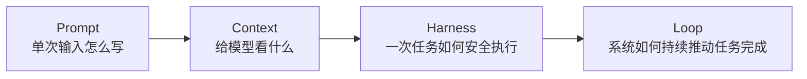
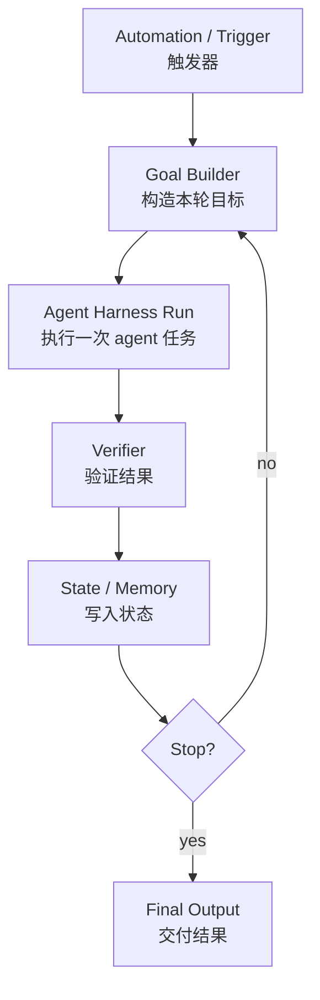
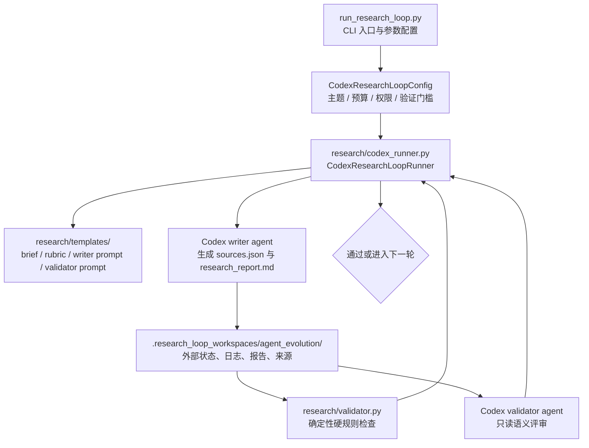
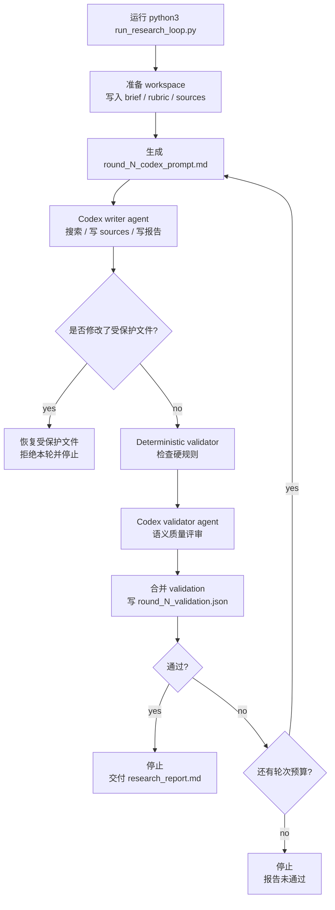
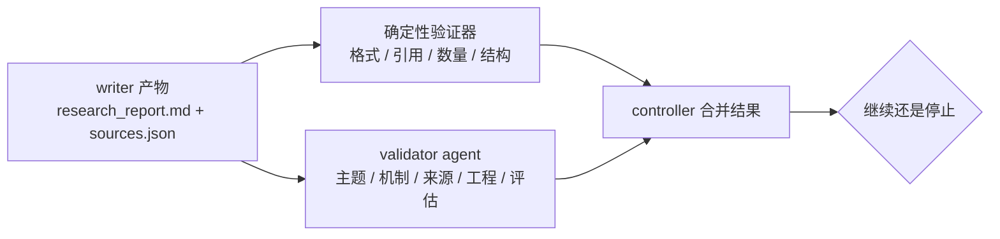
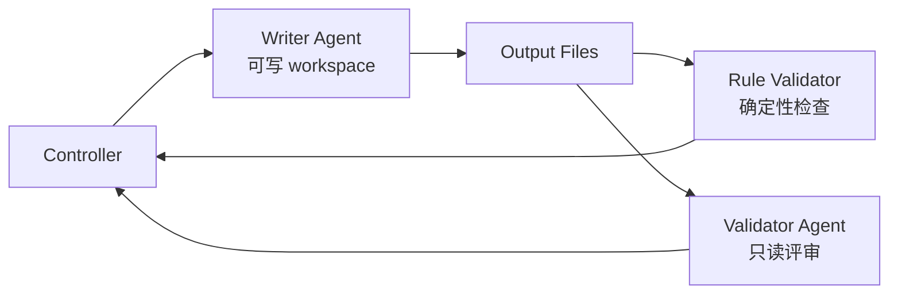

# Loop Engineering：从会写 Prompt，到会搭一个会循环的系统

过去使用 AI Agent，很多人习惯从 prompt 开始：把任务说清楚，把背景补完整，把格式要求写细，然后期待模型一次性给出好结果。

这在简单任务里有效。但任务一旦变长、变复杂、需要反复修订、需要引用来源、需要安全边界、需要可复盘，就会出现一个明显问题：

> 真正消耗人的地方，集中在持续检查结果、指出问题、补充上下文、重新推动 agent 往前走。

Loop Engineering 解决的正是这件事。

它是一种 agent 系统设计方法：把人手动反复 prompt、检查、纠错、记录的过程，变成一个外部 controller 可以自动运行的闭环。

当前仓库就是一个最小但完整的 Loop Engineering demo。它让 Codex writer agent 生成一份调研报告，再让 deterministic validator 和 Codex validator agent 检查报告质量。如果没通过，controller 会把验证结果写回下一轮 prompt，继续驱动 writer 修订，直到验证通过或预算耗尽。

一句话概括：

> Loop Engineering 是从“我反复提示 agent”变成“我设计一个系统，让系统反复触发、分配、验证、记录并驱动 agent 前进”。

## 目录

- [1. 为什么需要 Prompt 之外的系统](#1-为什么需要-prompt-之外的系统)
- [2. 什么是 Loop Engineering](#2-什么是-loop-engineering)
- [3. 一个 Loop 最少需要哪些部件](#3-一个-loop-最少需要哪些部件)
- [4. 当前项目在做什么](#4-当前项目在做什么)
- [5. 当前项目的闭环如何运行](#5-当前项目的闭环如何运行)
- [6. 代码结构如何对应 Loop 组件](#6-代码结构如何对应-loop-组件)
- [7. Validator 为什么是 Loop 的核心](#7-validator-为什么是-loop-的核心)
- [8. 如何搭建自己的 Loop Engineering](#8-如何搭建自己的-loop-engineering)
- [9. 最小可行实现模板](#9-最小可行实现模板)
- [10. 从 Demo 走向生产系统](#10-从-demo-走向生产系统)
- [11. 运行这个项目](#11-运行这个项目)
- [12. 总结](#12-总结)

## 1. 为什么需要 Prompt 之外的系统

Prompt Engineering 解决的是“单次输入怎么写清楚”。

比如你可以写：

```text
请调研 Agent 自主进化技术路线，要求包含技术脉络、代表论文、工程实现和评估方法。
```

如果只是要一个摘要，这可能够了。但如果你要的是一份给核心工程团队做技术对齐的长报告，问题就来了：

- 第一版可能结构完整，但来源偏旧。
- 来源可能数量达标，但正文只堆引用，缺少代表工作的展开。
- 工程章节可能写了概念，但缺少状态 schema、验证器、权限和回滚。
- 评估章节可能写了指标，但实验复现路径缺失。
- agent 可能声称完成了，但你仍然需要人工逐段检查。

于是人会进入一个隐形循环：

```text
写 prompt
  -> 等 agent 生成
  -> 人工检查
  -> 发现问题
  -> 继续补 prompt
  -> 再等 agent 生成
  -> 再检查
```

这个循环本来就在发生，只是由人脑和聊天窗口临时维持。

Loop Engineering 的关键变化是：把这个循环外部化、结构化、工程化。

## 2. 什么是 Loop Engineering

可以把 AI Agent 工程理解成四层递进：



四层分别解决不同问题：

| 层级 | 解决的问题 | 典型产物 |
| --- | --- | --- |
| Prompt | 怎么把单次任务说清楚 | 指令、格式要求、few-shot |
| Context | 给模型看什么信息 | 文件、检索结果、历史状态、工具说明 |
| Harness | 一次 agent run 如何执行 | 沙箱、工具权限、日志、输出约束 |
| Loop | 如何持续触发、验证、修复和停止 | controller、state、validator、budget、human escalation |

Loop Engineering 关注的是最后一层。

它默认一个事实：复杂任务很少一次成功。真正可靠的系统要能回答这些问题：

- 什么时候启动下一轮？
- 下一轮的目标从哪里来？
- agent 可以改哪些文件，不能改哪些文件？
- 怎么判断产物是否合格？
- 验证失败后，反馈如何进入下一轮？
- 什么时候停止？
- 出错时谁负责升级给人？
- 所有过程能不能复盘？

这已经进入系统设计范畴。Prompt 是循环中的输入材料，Loop 是决定这些材料如何被反复使用、验证和推进的系统。

## 3. 一个 Loop 最少需要哪些部件

一个可运行的 loop 至少需要 6 个部件。



这 6 个部件分别是：

| 部件 | 作用 | 如果没有它 |
| --- | --- | --- |
| Trigger | 启动或再次启动 loop | 只能靠人手动继续 |
| Goal Builder | 根据当前状态生成本轮任务 | 每轮都像第一次运行 |
| Agent Harness | 让 agent 在受控环境里执行 | 权限、日志、输出不可控 |
| Verifier | 判断结果是否真的合格 | agent 自称完成就结束 |
| State / Memory | 保存产物、日志、验证结果 | 不能复盘，也不能稳定续跑 |
| Stop Condition | 判断继续还是停止 | 要么停太早，要么无限跑 |

更成熟的系统还会加上：

- Worktree 或独立 workspace：隔离多轮或多 agent 的文件修改。
- Skills：把流程规则沉淀成可复用能力。
- Plugins / Connectors：连接 GitHub、CI、飞书、Linear、Sentry、数据库等外部系统。
- Sub-agents / Evaluators：把 maker 和 checker 分开。
- Human Escalation：高风险或不确定时升级给人。

## 4. 当前项目在做什么

这个仓库实现了一个 research loop。

它的目标是生成一份中文长报告：

```text
Agent 自主进化的技术路线、工程实现方式与评估方法
```

这个项目的实现方式是：用一个外部 Python controller 持续驱动两个 agent 完成调研、写作、验证和修订：

- writer agent：负责搜索资料、维护 `sources.json`、撰写或修订 `research_report.md`。
- validator agent：负责只读评审报告质量，输出结构化 JSON。

同时，controller 还运行一个确定性验证器，检查章节、引用、来源数量、年份比例、代码块、Mermaid 图、工程关键词等硬规则。

当前项目的核心结构：

```text
run_research_loop.py
research/
  codex_runner.py
  validator.py
  templates/
    brief.md
    rubric.md
    codex_prompt.md
    validator_prompt.md
```

对应到代码职责，可以画成这张结构图：



运行后，产物和中间状态会进入 workspace：

```text
.research_loop_workspaces/agent_evolution/
  brief.md
  rubric.md
  sources.json
  research_report.md
  round_1_codex_prompt.md
  round_1_codex.md
  round_1_rule_validation.json
  round_1_agent_validation.json
  round_1_validation.json
  round_2_codex_prompt.md
  round_2_validation.json
  ...
```

这些文件就是 loop 的外部记忆。下一轮以文件系统里的状态为准，包括上一轮报告、来源、prompt、日志和 validation。

## 5. 当前项目的闭环如何运行

当前项目的闭环可以画成这样：



一轮运行大致是：

1. controller 根据上一轮验证结果构造本轮 prompt。
2. writer agent 在 workspace 里执行一次 Codex run。
3. writer 生成或修改 `research_report.md` 和 `sources.json`。
4. controller 检查 writer 是否改了受保护文件。
5. deterministic validator 检查硬规则。
6. validator agent 做语义质量评审。
7. controller 合并两类验证结果。
8. 如果通过，停止。
9. 如果失败，把验证结果注入下一轮 prompt，继续。

这就是 Loop Engineering 的基本形状：

```text
Trigger -> Goal -> Agent Run -> Verify -> Update State -> Next Trigger
```

在这个项目中，对应为：

```text
CLI 启动
  -> 本轮 writer prompt
  -> Codex writer run
  -> hybrid validation
  -> workspace state
  -> 下一轮 prompt
```

## 6. 代码结构如何对应 Loop 组件

### 6.1 `run_research_loop.py`：入口和配置

`run_research_loop.py` 是 loop 的启动入口。

它定义了主题、workspace、最大轮数、来源数量、年份比例、validator 模型、沙箱权限、是否启用 search 等配置。

默认配置里比较关键的是：

```text
workspace              .research_loop_workspaces/agent_evolution
max_rounds             5
min_sources            15
source_year            2026
min_source_year_ratio  0.8
min_section_chars      1800
validator_model        gpt-5.5
validator_reasoning    xhigh
enable_search          True
enable_agent_validator True
```

这说明 loop 不只关心“做什么”，也关心“最多做几轮”“质量门槛是什么”“用什么方式验证”“agent 有什么权限”。

### 6.2 `research/codex_runner.py`：真正的 loop controller

这个文件是项目最核心的部分。

它负责：

- 准备 workspace。
- 渲染每轮 writer prompt。
- 调用 Codex CLI。
- 保存 stdout / stderr 日志。
- 保护 brief、rubric 和 validation 文件。
- 调用 deterministic validator。
- 调用 Codex validator agent。
- 合并验证结果。
- 判断继续还是停止。

Codex 在这里是被 loop 调度的执行单元；controller 才承担循环控制、状态管理、验证合并和停止判断。

真正的 loop 是 `CodexResearchLoopRunner.run()`。

核心逻辑可以简化成：

```python
validation = initial_goal_context()

for round_number in range(1, max_rounds + 1):
    prompt = build_codex_prompt(round_number, validation)
    run_codex_writer(prompt)
    validation = run_external_validation(round_number)

    if validation["passed"]:
        return True

return False
```

这段逻辑看起来简单，但它完成了一个很重要的工程转变：让“继续提示 agent”从人的临时动作，变成系统的固定控制流。

### 6.3 `research/validator.py`：确定性验证器

deterministic validator 负责检查适合用代码稳定判断的规则。

比如：

- `research_report.md` 是否存在。
- 必需章节是否齐全。
- `sources.json` 是否是合法 JSON。
- 来源 ID 是否从 `S1` 连续编号。
- URL 是否重复。
- 来源数量是否达标。
- 2026 年来源比例是否达标。
- 每个来源是否在正文中被引用。
- 每个章节是否达到最小长度。
- 工程章节是否包含 `loop`、`验证器`、`状态`、`权限`、`人工升级`。
- 工程章节是否包含代码块和 Mermaid 图。

这些规则的特点是：代码可以稳定检查，系统就用确定性逻辑做门禁。

### 6.4 `research/templates/*.md`：把规则变成可复用上下文

模板目录里有四个文件：

| 文件 | 作用 |
| --- | --- |
| `brief.md` | 定义任务目标 |
| `rubric.md` | 定义报告必须满足的质量要求 |
| `codex_prompt.md` | 告诉 writer agent 每轮怎么工作 |
| `validator_prompt.md` | 告诉 validator agent 如何评审和输出 JSON |

这些模板相当于轻量级 skill。

它们把“这个任务应该怎么做”“什么叫通过”“上一轮问题如何修”从人的脑子里拿出来，变成 loop 每轮都能读取的规则。

## 7. Validator 为什么是 Loop 的核心

只有 prompt 自动重复的循环，本质上只是自动重试。

有 validator 的循环，才有可能无人值守。

当前项目使用两层验证：



### 7.1 第一层：确定性规则

确定性验证器负责做硬检查。

它不理解文章好不好，但它能稳定判断：

- 章节少没少。
- 来源够不够。
- ID 是否连续。
- 引用是否有效。
- 每个来源是否真的进入正文。
- 工程章节有没有必要元素。

这些检查不需要创造力，需要稳定性。

### 7.2 第二层：语义评审

Codex validator agent 负责更像 reviewer 的判断。

它会看：

- 报告是否真的聚焦 Agent 自主进化。
- 技术路线是否覆盖充分。
- 每条路线是否讲清状态、触发条件、优化目标、验证器、失败模式。
- 来源是否被深读，引用是否停留在句尾堆叠。
- 工程实现是否能指导团队落地。
- 评估方案是否可复现。
- 选型建议是否能指导决策。
- 文章是否适合作为技术分享底稿。

它还必须输出 8 维 scorecard：

```text
topic_coverage
technical_routes
mechanism_depth
source_grounding
engineering_usability
evaluation_design
adoption_guidance
readability
```

### 7.3 第三层：controller 对 validator 再设硬门槛

validator agent 也是模型，所以 controller 不能盲信它。

当前项目里，controller 会继续检查 validator 输出：

- 总分必须至少 96。
- 所有 scorecard 维度至少 90。
- `mechanism_depth`、`source_grounding`、`engineering_usability`、`evaluation_design` 至少 92。
- `blocking_notes` 必须为空。
- `issues`、`required_fixes`、`modification_suggestions`、`non_blocking_findings`、`residual_risks`、`source_audit_notes`、`next_improvements` 必须清空。

这就是一个很重要的原则：

> 模型可以参与评审，但系统必须保留最终门禁。

## 8. 如何搭建自己的 Loop Engineering

你可以按下面 8 步搭建自己的 loop。

### 第一步：选一个适合 loop 的任务

优先选择适合 loop 的任务。

适合 loop 的任务通常有这些特征：

- 一次完成概率低，需要多轮修订。
- 有明确产物，比如报告、代码、测试、PR、数据表、分析结果。
- 可以定义验收标准。
- 过程需要记录。
- 失败后可以给出下一轮修复方向。

下面这类任务适合先用单次交互处理：

- 极短的一次性问答。
- 输出物不明确。
- 验证标准不明确。
- 每一步都必须由人做主观判断。

### 第二步：定义产物

先明确 agent 最终要交付什么。

在当前项目里，产物是：

```text
research_report.md
sources.json
```

如果你做代码修复 loop，产物可能是：

```text
modified source files
tests
PR description
```

如果你做数据分析 loop，产物可能是：

```text
analysis.md
metrics.csv
charts/
```

产物越明确，validator 越容易写。

### 第三步：把任务目标写成 brief

brief 应该写成任务合同。

它要说清楚：

- 给谁看。
- 解决什么问题。
- 最终产物做什么用。
- 哪些内容必须有。
- 哪些内容不要写。
- 什么结果会被判定为低质量。

当前项目的 `brief.md` 就明确说明：报告要用于 agent 核心团队技术对齐，重点放在技术路线、来源深读、工程落地和评估方法上。

### 第四步：把验收标准写成 rubric

rubric 是 loop 的质量合同。

好的 rubric 应该尽量可检查：

- 必须有哪些章节。
- 最少多少来源。
- 来源字段有哪些。
- 正文引用规则是什么。
- 每个章节最低展开程度是什么。
- 哪些空泛表达禁止使用。
- 工程章节必须覆盖哪些元素。

当前项目的 `rubric.md` 就定义了这些规则。

这一步很关键。rubric 会让后面的 validator 拥有明确判断依据。

### 第五步：设计 workspace state

让 loop 以外部状态为准。

把状态放进文件或数据库：

```text
workspace/
  brief.md
  rubric.md
  current_output.md
  sources.json
  round_1_prompt.md
  round_1_agent.log
  round_1_validation.json
  round_2_prompt.md
  round_2_validation.json
```

这样做有三个好处：

- 可恢复：中断后能继续。
- 可审计：知道每轮发生了什么。
- 可调试：失败时能看 prompt、日志和 validation。

### 第六步：分离 writer 和 validator

让 writer 和 validator 分离。

更好的结构是：



权限也要分开：

- writer agent 可以修改目标产物。
- validator agent 只读。
- controller 才能决定是否停止。
- brief、rubric、validation 历史应该受保护。

当前项目里，writer 使用 `workspace-write`，validator 使用 `read-only`，就是这个设计。

### 第七步：把失败反馈变成下一轮目标

loop 的关键是把失败转化成下一轮可执行目标。

当前项目会把上一轮 validation JSON 注入下一轮 writer prompt：

```text
当前 goal / validation context：
{
  "passed": false,
  "issues": [...],
  "rule_validation": {...},
  "agent_validation": {...}
}
```

writer 下一轮基于上一轮产物和验证结果继续推进，优先修复具体问题。

这比“再试一次”强得多。因为系统知道为什么失败，也知道下一轮应该优先修什么。

### 第八步：定义停止条件和预算

loop 必须能停。

至少要有：

- 最大轮数。
- 单轮超时。
- 通过条件。
- 不可信验证时的停止策略。
- agent 越权修改时的拒绝策略。

当前项目的停止条件包括：

- hybrid validation 通过，停止。
- validator agent 失败，停止。
- writer 修改受保护文件，恢复并停止。
- writer 失败且没有候选产物，停止。
- 最大轮数耗尽，停止。

这比“让 agent 一直跑到它觉得完成”可靠得多。

## 9. 最小可行实现模板

如果你要从零搭一个自己的 loop，可以先按这个骨架写。

```python
from pathlib import Path


def run_loop(workspace: Path, max_rounds: int) -> bool:
    prepare_workspace(workspace)
    validation = {"passed": False, "issues": [], "goal": "create first output"}

    for round_number in range(1, max_rounds + 1):
        prompt = build_prompt(workspace, round_number, validation)
        save_text(workspace / f"round_{round_number}_prompt.md", prompt)

        result = run_writer_agent(workspace, prompt)
        save_logs(workspace, round_number, result)

        if changed_protected_files(workspace):
            restore_protected_files(workspace)
            return False

        rule_validation = run_rule_validator(workspace)
        agent_validation = run_validator_agent(workspace, rule_validation)
        validation = combine(rule_validation, agent_validation)

        save_json(workspace / f"round_{round_number}_validation.json", validation)

        if validation["passed"]:
            return True

    return False
```

这个骨架里有几个不能省的点：

- `prepare_workspace()`：准备外部状态。
- `build_prompt()`：把上一轮验证反馈注入下一轮目标。
- `run_writer_agent()`：执行一次 agent harness run。
- `changed_protected_files()`：检查权限边界。
- `run_rule_validator()`：做确定性硬检查。
- `run_validator_agent()`：做语义质量评审。
- `combine()`：由 controller 统一判断是否通过。

如果你把这些部件都留出来，后面就可以逐步增强。

## 10. 从 Demo 走向生产系统

当前项目是一个研究型单任务 loop demo。它已经体现了 Loop Engineering 的核心，生产级系统还需要补齐更多能力。

生产化通常要补四类能力。

### 10.1 更真实的 Automation

当前项目靠手动命令触发：

```bash
python3 run_research_loop.py
```

生产系统可能需要：

- 定时任务。
- GitHub Actions。
- CI failure trigger。
- issue / ticket trigger。
- 飞书或 Slack 消息触发。
- 监控告警触发。

### 10.2 更强的隔离和并行

当前项目用单 workspace 隔离产物。

如果做代码修改或多 agent 竞赛，可能需要：

- 每个候选方案一个 Git worktree。
- 多 writer agent 并行。
- evaluator 选择最佳方案。
- merge controller 负责合并。
- 回滚策略处理失败候选。

### 10.3 更多 Connectors

当前项目主要连接 Codex CLI 的 search 能力。

生产系统往往还要连接：

- GitHub / GitLab。
- CI。
- Linear / Jira。
- 飞书 / Slack。
- Sentry / Datadog。
- 内部知识库。
- 数据库或指标平台。

Connectors 决定 loop 能不能进入真实业务系统。

### 10.4 Human Escalation

真正的无人值守系统会在合适的时机找人，并把人工确认纳入控制流。

常见升级条件：

- 权限风险过高。
- validator 无法判断。
- 连续多轮失败。
- 修改影响生产数据。
- 成本超过预算。
- 安全策略命中。

一个成熟 loop 应该能暂停、通知人、等待确认，然后继续或终止。

## 11. 运行这个项目

默认运行：

```bash
python3 run_research_loop.py
```

只生成 workspace 和第一轮 prompt，不调用 Codex：

```bash
python3 run_research_loop.py --dry-run
```

限制最大轮数：

```bash
python3 run_research_loop.py --max-rounds 2
```

保留已有 workspace：

```bash
python3 run_research_loop.py --keep-workspace
```

关闭 validator agent，只跑确定性检查：

```bash
python3 run_research_loop.py --no-agent-validator
```

默认产物位置：

```text
.research_loop_workspaces/agent_evolution/research_report.md
.research_loop_workspaces/agent_evolution/sources.json
```

最近一次真实运行中，这个 loop 在第 2 轮通过：

```text
Round 1:
  writer 生成第一版报告。
  deterministic validator 通过。
  agent validator 未通过，指出来源深读和工程 schema 不足。

Round 2:
  writer 根据 round_1_validation.json 修订。
  补齐代表来源深读和 TraceEvent / Trajectory schema。
  deterministic validator 通过。
  agent validator 打 97 分。
  review backlog 清空。
  loop 停止。
```

这说明 loop 的停止依据是验证系统判断产物已经达标。

## 12. 总结

Loop Engineering 的核心是让系统承担原本由人反复做的控制工作。

在这个项目里：

- `run_research_loop.py` 是入口和配置层。
- `research/codex_runner.py` 是外部 controller。
- `research/validator.py` 是确定性验证器。
- `research/templates/*.md` 是任务规则和评审规则。
- `.research_loop_workspaces/agent_evolution/` 是外部状态和记忆。
- Codex writer agent 负责生成和修订。
- Codex validator agent 负责只读语义评审。
- controller 负责权限、预算、日志、验证合并和停止条件。

这就是一个最小但完整的 loop：

```text
目标明确
  -> agent 执行
  -> validator 检查
  -> 状态写回
  -> 失败继续
  -> 通过停止
```

如果说 Prompt Engineering 关注的是“这一句话怎么写”，Loop Engineering 关注的就是“这个系统如何一次次把事情推到完成，并且知道什么时候不该继续”。

这也是从个人使用 AI，走向团队级、生产级 agent 工程的关键一步。
